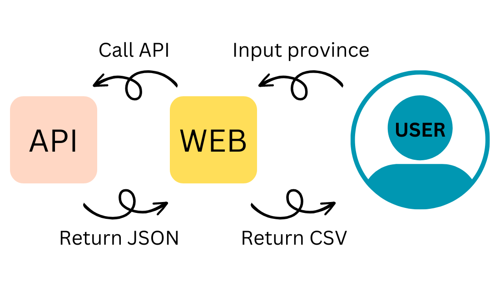

# templebangkok

ฺ**WCTIT** Web crawling Temple in Thailand

โดยนำข้อมูลมาจาก Wikipedia

**มีวัดที่นอกเหนือจากงานอยู่ 4 จังหวัดที่ไม่สามารถดึงได้เนื่องจาก Format หน้าบ้าน ไม่ปกติ ทำให้สกัดด้วยวิธีตามโจทย์โดยตรงไม่ได้**

#

Frontend React กับ Backend FastAPI

#

## HOW IT WORK?



ทำการใส่รายชื่อจังหวัดที่ต้องการสืบข้อมูลวัด เมื่อกรอกข้อมูลจะไปทำการเรียก API ที่ทำการเขียน Regex เพื่อสกัดหาวัดออกมาจาก Wikipedia แล้วทำการส่งข้อ JSON กลับไปให้กลับ Frontend เพื่อแสดงผล รวมไปถึงสามารถกด Download CSV ให้กับ USER ได้

## RegEx

ทางกลุ่มได้ใช้ RegEx 2 ครั้งเพื่อสกัดออกมาจากหน้าเว็บ

**ครั้งที่ 1** (วัด.\*) (?:ตำบล|แขวง)

เพื่อทำการค้นหาตัวอักษรใดๆก็ตามที่ขึ้นต้นด้วยวัด จนถึงมีคำว่า ตำบล หรือ แขวง
เช่น วัดกก วัดขข (คค) ตำบลงง สิ่งที่ได้ออกมาจะเป็น วัดขข*(คค)* โดยจะได้มาเป็น list ที่เข้าเงื่อนไขแรก

**ครั้งที่ 2** วัด\S+

ทำการเอาคำใน list ที่ได้ออกมาทำการ Loop เพื่อเอาแค่คำว่า วัดจนถึง Whitespace เช่น วัดขข*(คค)* จะเหลือเพียง วัดขข

## API Reference

#### Get Temple JSON

```http
  GET /province?province={province}
```

| Parameter  | Type     | Description                       |
| :--------- | :------- | :-------------------------------- |
| `province` | `string` | **Required** province in Thailand |

## Features

- ทำการค้นหาได้ 72 จังหวัด
- สามารถดาวน์โหลดไฟล์ CSV แยก หรือรวม

## Tech Stack

**Client:** React , JS

**API:** FASTAPI
